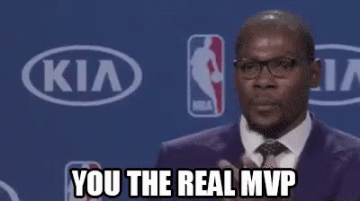

I remember the first time I heard the acronym MVP used in an office setting. It was a bit confusing because I wasn’t sure why we were referring to a project as the “most valuable player”. Could it have been “most valuable project” ? That also didn’t sound quite right. I quickly googled and found out that MVP also stands for “minimum viable product” which seemed to fit the context. Ding, ding, ding!

Throughout the remainder of my tenure as an account manager at a SaaS startup, MVP was everything. My team’s job was to make sure customers were getting the best value from their partnership, and that meant that the products they used needed to continually evolve and improve. We needed to know what MVP looked like, when we could expect to see it internally, and most importantly, when we could deliver an upgraded product to the end user. 

As anyone who has ever worked anywhere knows, timelines change, priorities get shuffled, and MVP shapeshifts along the way like some type of Animorph. 

  

## As a new developer, I can certainly relate.

It’s been 20 days since I graduated from the software engineering immersive at Flatiron School, and I’ve never felt more like a fledgling MVP. There are so many competing priorities, so many things to learn, so many concepts to review, algorithms to practice, jobs to apply to, emails to send. If a product manager asked me to give a timeline for my own MVP, I’d want to curl up in a tiny ball and play dead. 

But instead, what I am going to do is write this blog post as a way to start thinking about my post-bootcamp life as an actual product that deserves all of the thought and careful consideration that an actual MVP requires. And who knows, perhaps this will inspire someone else in the same situation.

Let’s start by breaking down what MVP really means: 

**Minimum**: the most basic features and functionality

**Viable**: providing just enough value that an end user is able to get something out of it  

**Product**: in working order today

An MVP is not a beta version of a product, nor is it polished in any capacity; rather, it is a way to get <em>something</em> out there and worth testing. MVP allows for agility and accelerated decision making so that we can test, ask questions, iterate, etc. with less risk of wasting resources. 

To define what a particular MVP should look like, it’s essential to thoroughly think about the problem that needs to be solved. If there isn’t actually an issue that needs to be addressed, it’s not necessary to move past this point. In my case, I have a large opportunity/pain point in that I’m unemployed and new to programming. This is worthy of time and resources to fix. Check!

  

Next, it’s important to consider the most direct path to solving the problem. What does that look like with no bells or whistles? For me, that path looks like sticking to a basic plan of action that I can follow to make progress on my goal of becoming employed and becoming better at coding. Okay, I have my direct path. Check!

From there, it’s all about outlining a simple course of action to get something quick and dirty in working order. Using an agile methodology like scrum or kanban can help keep things organized. I love using [Trello](https://trello.com) for my personal projects. 

Find your own rhythm by exploring tools and trying different methods of execution. Whatever you do, just keep chipping away.

Here, I present to you my first blog post on my MVP of a personal website in my MVP of a career change. Check, check, and check! 

Now, it’s now time to iterate, add the cool features, build more functionality, continue tiny versions of MVPs every day, and learn as much as possible along the way. 

  

Wishing everyone so much luck in the quest to MVP, whatever that may be, and as my muse Shania likes to say: 
##“Let’s go girls...DAH NAH NAH NAH NAH NAH NAH.”
<!-- 

  

 -->

<!-- > Far far away, behind the word mountains, far from the countries Vokalia and
> Consonantia, there live the blind texts. Separated they live in Bookmarksgrove
> right at the coast of the Semantics, a large language ocean. -->
<!-- 
It is a paradisematic country, in which roasted parts of sentences fly into your
mouth. Even the all-powerful Pointing has no control about the blind texts it is
an almost unorthographic life One day however a small line of blind text by the
name of Lorem Ipsum decided to leave for the far World of Grammar.

### According a funnily until pre-set or arrogant well cheerful

The Big Oxmox advised her not to do so, because there were thousands of bad
Commas, wild Question Marks and devious Semikoli, but the Little Blind Text
didn’t listen. She packed her seven versalia, put her initial into the belt and
made herself on the way.

1.  So baboon this
2.  Mounted militant weasel gregariously admonishingly straightly hey
3.  Dear foresaw hungry and much some overhung
4.  Rash opossum less because less some amid besides yikes jeepers frenetic
    impassive fruitlessly shut

When she reached the first hills of the Italic Mountains, she had a last view
back on the skyline of her hometown Bookmarksgrove, the headline of Alphabet
Village and the subline of her own road, the Line Lane. Pityful a rhetoric
question ran over her cheek, then she continued her way. On her way she met a
copy.

> The copy warned the Little Blind Text, that where it came from it would have
> been rewritten a thousand times and everything that was left from its origin
> would be the word "and" and the Little Blind Text should turn around and
> return to its own, safe country.

But nothing the copy said could convince her and so it didn’t take long until a
few insidious Copy Writers ambushed her, made her drunk with Longe and Parole
and dragged her into their agency, where they abused her for their projects
again and again. And if she hasn’t been rewritten, then they are still using
her. Far far away, behind the word mountains, far from the countries Vokalia and
Consonantia, there live the blind texts.

#### Silent delightfully including because before one up barring chameleon

Separated they live in Bookmarksgrove right at the coast of the Semantics, a
large language ocean. A small river named Duden flows by their place and
supplies it with the necessary regelialia. It is a paradisematic country, in
which roasted parts of sentences fly into your mouth.

Even the all-powerful Pointing has no control about the blind texts it is an
almost unorthographic life One day however a small line of blind text by the
name of Lorem Ipsum decided to leave for the far World of Grammar. The Big Oxmox
advised her not to do so, because there were thousands of bad Commas, wild
Question Marks and devious Semikoli, but the Little Blind Text didn’t listen.

##### Wherever far wow thus a squirrel raccoon jeez jaguar this from along

She packed her seven versalia, put her initial into the belt and made herself on
the way. When she reached the first hills of the Italic Mountains, she had a
last view back on the skyline of her hometown Bookmarksgrove, the headline of
Alphabet Village and the subline of her own road, the Line Lane. Pityful a
rhetoric question ran over her cheek, then she continued her way. On her way she
met a copy.

###### Slapped cozy a that lightheartedly and far

The copy warned the Little Blind Text, that where it came from it would have
been rewritten a thousand times and everything that was left from its origin
would be the word "and" and the Little Blind Text should turn around and return
to its own, safe country. But nothing the copy said could convince her and so it
didn’t take long until a few insidious Copy Writers ambushed her, made her drunk
with Longe and Parole and dragged her into their agency, where they abused her
for their projects again and again. -->
