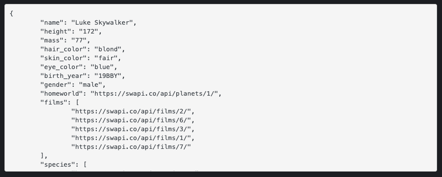

Once upon a time when I worked at Facebook, I was privy to a conversation two people were having about APIs. I was in a non-technical role at the time and had never learned about what an API actually was. The fact that someone could somehow “plug in” and access Facebook data seemed extremely worrisome. I was surprised that such a company would ever allow developers to penetrate any of its data whatsoever. Then, I remembered I worked at Facebook, which meant there were a lot of free snacks down the hall just waiting for me to eat them, and I promptly forgot about the entire experience.

  

Fast forward to April 23, 2019, the second day of boot camp and also the day we walked through how to access and work with [SWAPI](https://swapi.co/), the Star Wars API. Some of my initial thoughts: 
* What is this, exactly?
* Why would anyone ever make this?
* Why would anyone ever use this?
* Accessing and working with the data is a lot more straightforward than I would have guessed. Is that how all APIs work?

As the weeks progressed the answers to these questions become more apparent, but even upon graduating from Flatiron School, my understanding of APIs was still Jello at best. In hopes of getting that Jello to more of a firm Haribo gummi bear consistency, here’s some information on what the actual heck an API is: 

  

API stands for Application Programming Interface. Just like we, as humans, interact with user interfaces, machines have interfaces upon which they rely to parse and interact with data. If analogies help, think of how we access information by interacting with our phones (tapping icons on a screen to get to a desired outcome). One way machines access information is via APIs. 

When machines access APIs, they do so through a shared contract between the application using the API (the client) and the API provider. If the stipulations of the contract aren’t followed exactly, there’s a breakdown in the transaction. You can think of this like a credit card chip reader and a credit card. For a payment to successfully process, a chip must be present and must remain inserted in the reader for the amount of time it takes the reader to do its job. If the chip is only halfway inserted, or if it’s pulled out too quickly, this will never work. In this analogy, the chip is the client and the credit card reader is the API.

Developers use the magic between client (their machine) and provider (API) to outsource some of the work that applications need to do. For example, let’s say a smart developer decides to capitalize on the fact that walking is overrated, overhyped, and frankly passé. Instead, this developer thinks, why not have electric scooters to shuttle human bodies from place to place? It’s quick and fun and you look v cool doing it. In building an app for people to find said scooters, the developer needs to be able to have functionality showing a map of a user’s surrounding area with scooter location information. Instead of writing code to build out an entire replica of Google Maps, the developer outsources that job to the Google Maps API. Let’s also say this app needs to be able to complete secure credit card transactions. You know the old saying “there’s no such thing as a free e-scooter ride.” So, instead of writing the code to build secure payment processing functionality, the developer outsources this work to a secure payment processing API like PayPal. 

  

And even on a much smaller scale, APIs can have a huge impact. When I built my final project at boot camp, I wanted to have a functional lunch date generator, so I made good use of Yelp’s API. Rather than spending hours manually seeding my database with restaurant information, I could make a call to Yelp’s collection of restaurant data in just a few lines of code. What I got back from Yelp was a distilled version of restaurant page data in a format called JSON (JavaScript Object Notation). JSON is great because both humans and computers can easily read and write it. Because of the magic of APIs, I was then free to focus on the logic I needed to code to get that information to show up in the way I desired.

I will say that after researching this topic extensively, I still cannot answer my preexisting questions on why someone would choose to spend time composing and/or using a Star Wars API, but I think that says more about me than it does APIs. In any case, hopefully I’ve helped to somewhat solidify an understanding of these helpful mechanisms. If not, some amazing resources that might do the trick include: 
  

[What is an API? In English, please](https://www.freecodecamp.org/news/what-is-an-api-in-english-please-b880a3214a82/)

[What is an API?](https://www.youtube.com/watch?v=s7wmiS2mSXY)

[How to Use an API: Just the Basics](https://technologyadvice.com/blog/information-technology/how-to-use-an-api/)

