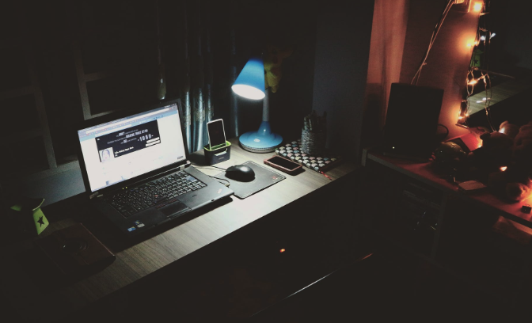
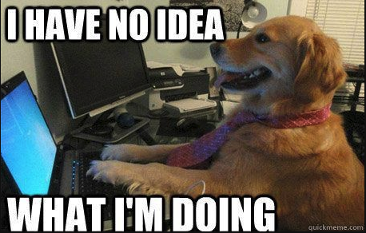
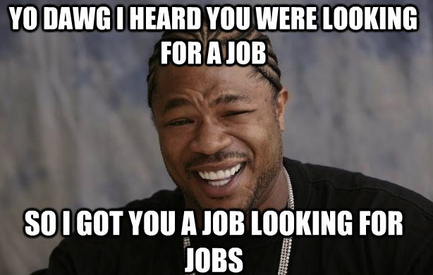

When I worked at The Muse, talking about how to be productive in the office was a big topic of discussion. Not only did the editorial team give great advice to readers (shout out to [Jenni Maier](https://www.themuse.com/advice/heres-how-to-succeed-when-youre-not-an-early-bird-or-a-night-owl) and [Adrian Granzella Larssen](https://www.themuse.com/advice/trust-me-this-time-management-strategy-never-fails)) but because the office was an open floor plan, it was an important skill set to sharpen.

One of the concepts that stuck with me is the idea of golden hours: that daily window of time during which one is most productive. [Golden hours](https://www.themuse.com/advice/trust-me-this-time-management-strategy-never-fails) are near and dear to my heart because I only have so many of them. And it turns out that golden *coding* hours are even more rare. Sure, there’s a wealth of silver and bronze hours, but as for the time when I can count on a pure flow state just between VS Code and myself…that’s the good stuff, and it doesn’t grow on trees.

  

I’m not sure if anyone else reading this can relate, but in the case you’re anything like me, I hope some of these tips are helpful. 

*** Disclaimer: I am currently not working a full time job, and I don’t have a family depending on me, so I get creative license over my time management. Still, I believe these points can apply generally to many schedules.**

### If possible, block off your golden hours.
Mine fall between 6 am and 12 pm. It’s mostly impossible to have no interruptions for that long of a block, but I try to limit things like Instagram checking, texting, emailing, etc. 

During these hours I make sure that I’m capitalizing on my brain’s capacity to solve algorithms, work on creative projects, and digest new reading material. I usually can’t do all three, but I have a rotating schedule and pick one thing to really focus on each morning. 

  

### Take an actual break. No coding allowed.

This is challenging for me, especially when I am struggling with something. I can easily stay in the same position for hours trying to get my code to execute in a certain way, and banging my head against an imaginary wall trying to understand a Leetcode problem is one of my special talents. However, I do my best to listen to my body -- specifically, my stomach. And when it starts trying to get my attention, I take that as a cue to stop and come back later. 

Luckily (or annoyingly), I am the kind of person who will never, and I mean NEVER, forget about a meal, so I have an alarm clock built in. If that's not you, may I suggest setting an actual alarm clock. 

During this break, I don’t look at work. This hasn’t always been the case, though. At every job I’ve ever had, you could cash me -- no, not outside, but rather  -- at my desk, furiously eating a salad and clacking away at my keyboard. However, in my current role, which consists of securing a full time job, no one is going to die or lose millions of dollars if I take an hour to mindfully eat food and catch up on news. Let's let that knowledge have some time to marinate and sink in, instead! 

  

### Save admin tasks for your non-golden hours.

You know what will always always be there? Emails to answer, errands to run, and meetings to schedule. Personally, checking things off of a list gives me a sense of accomplishment. This is not true for everyone, but if it is for you, save those easily executable tasks for a time when you might not feel as creative. Here's a real life example: when I try to solve Leetcode problems in the late afternoon, I feel sad and depressed and like a huge dummy (honestly, not far from how I feel when I try to solve them at my most productive...those things are hard). However, when I reply to seven emails in the late afternoon, I feel like I’ve done something productive (because I have!) and have thus earned my dinner *and* an hour of Bravo. 

  

### Other complimentary strategies I’m a big fan of include:

#### 1. Grouping like tasks together.  
For example, if you work on a personal project for two hours and you're writing JavaScript, your brain is already warmed up when you switch over to algorithm practice. Build that muscle memory!

#### 2. Moving vigorously. 
 I prefer to do it in the morning because it sets the stage for a great day, but I’ve also found that really fun things happen at the gym when you have so much aggressive energy because none of your code works. Do what works for you!

#### 3. Taking your show on the road.    
Working from a coffee shop, public library, etc. can hold many boons: 
- It’s a break from the routine and can stimulate creativity
- Ambient noise and having an “audience” makes you want to get to work
- If you don’t bring your laptop charger, you only have so much time to complete your tasks

---

Of course, this doesn’t even begin to scratch the surface of how best to harness your own golden hours, and I’d encourage everyone to experiment with different strategies, explore resources, and most importantly, tune in. Don’t silence the voice that is begging for a break. Establish an agreement between your brain and your inner critic, and be self aware enough to know when you’ll only get diminishing returns on investment. 

  

As Robert Frost/S.E. Hinton/Francis Ford Coppola would remind all of us, keep those golden hours gold, Ponyboy.
