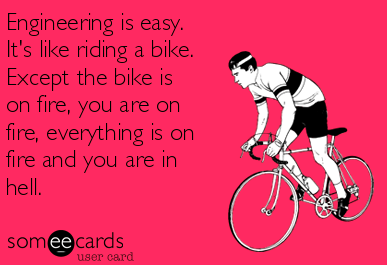

So far in my programming journey, I’ve experienced the feeling that I’m extremely late to a very happening party. In a sense, I am. While my peers were pursuing CS degrees, the mere consideration of learning anything about computers did not cross my mind. I was weak in math and pretty good at other things, so I went to college for those other things. Until a few months ago, I’d never written more than a few basic lines of HTML. Many days, I question my decision to free fall into this career change without a solid background in/understanding of foundational concepts. There is so much I’ve been NOT doing while everyone else in this field has been doing, and doing, and doing, and practicing, and drilling in, and mastering. I think about how I can never possibly catch up.

<p align="center">
  
</p>

Then, I take a deep breath and tell myself to buck up. And I also remember that there are actually a few great benefits of being a laggard over an early adopter. For example, I’m neither clutching on white-knuckled nor subconsciously, to certain outmoded conventions because I simply don’t know what they are! One of these I’ve experienced recently quite a bit is avoiding the use of **var** in JavaScript code. 

During boot camp, this was glossed over fairly quickly, but I wanted to know more about var and why some consider it to be a pariah. According to [w3schools.com](https://www.w3schools.com/jsref/jsref_var.asp): 
> The var statement declares a variable<br></br>
> Variables are containers for storing information <br></br>
> Creating a variable in JavaScript is called ‘declaring’ a variable 

Here is an example of how one would use var: 
```javascript 
var a   //first, make the declaration
a = 1   //then, initialize
```

Or, to kill two birds with one line of code: 

```javascript

var c = 5  //declaration + initialization
```

This seems innocuous enough, but here are two major things to keep in mind: 

1. A variable using var can be redefined without raising an error 

```javascript

function confusing(){
    var pet = 'cat'
    var pet = 'dog'
    
    console.log(`I’m more of a ${pet} person`)
}

confusing() //outputs "I'm more of a dog person"
```
This specific function is not something anyone would likely run into in a real world setting, but it's surprisingly easy to reassign variable values. I can’t count the number of times I’ve forgotten variable names and tried to reassign without realizing.

2. Var has functional scope, not block scope. This means that the variable is hoisted to the top of the function and able to be accessed globally. Alternatively, by using declarations that have block scope, like **const** and **let**, we can declare variables inside of a block and those variables only exist inside that block. This lends a bit more control and wherewithal when working with lots of variables.

Using **var**
```javascript

for (var i = 0; i < 5; i++) {
  /* do something in the loop */
}
console.log(i);  // outside of the block, but still able to access i. This will output 5.

```
Using **let** or **const**
```javascript 
for (let i = 0; i < 5; i++) {
  /* do something in the loop */
}
console.log(i);  // outside of the block, variable not accessible. Will result in an error.
```

Basically, there are two types of variables: variables that stay the same and variables that will change. **Const** takes care of the former; **let** takes care of the latter. With that in mind, is there a seat at the table anymore for **var**? According to the vast majority of people and resources I’ve come in contact with, the answer is no. That said, I'd love to have a conversation with someone of differing opinion. I know you're out there! 

<p align="center">
  
</p>

These days, in the container that is my brain, the competition for a secure place in memory is fierce. Thankfully, because I waited to start learning how to use JavaScript, remembering when to use var and when not to use var is something that I don’t have to worry about. Of course, as my coding career goes on, this type of luxury will fade away. New methods will come into play and old habits will always die hard. The rate at which programming languages and conventions change can seem overwhelming and scary, or it can be encouraging. For me right now, it’s both. And that is so much better than stagnation in either case. I'm fashionably late and ready to party. 