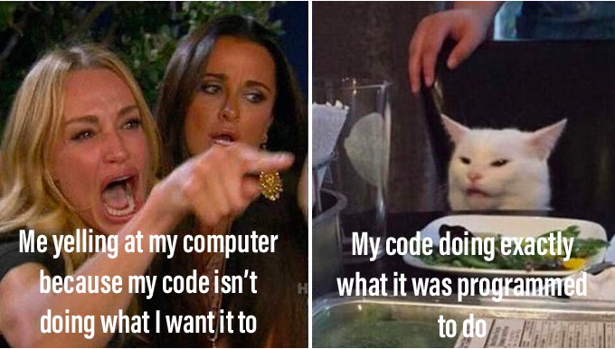

You know the feeling you get when you write some code and then it does exactly what you intended for it to do? Or like when you need to drive somewhere and end up catching every single green light? One could say that only the latter is divine intervention, but I’d argue that they both are (and honestly, it seems as though the former happens less frequently).

<p align="center">
  
</p>

In the process of writing a program, there are countless opportunities for code to work or not work. Personally, I find that I get the biggest thrill when either of the following occurs:

1. I finally win a logic battle with many lines of code after spending hours banging my head against a wall.
2. A small chunk of code does something really powerful without hours spent banging my head against a wall. 

Accessing an API can fall into either of the aforementioned buckets, but I’m going to write about the second one because it’s Friday. 

So how can *not* writing a whole lot of complicated, logic-heavy code fulfill the act of accessing the treasure chest that is an API? With something called ```fetch()```. 

```fetch()``` is similar to something called XHR, which is short for XMLHttpRequest (XHR deserves its own blog post, so I won’t dive too deeply into it here). With both methods, we are making a network request to get some type of response from an end point that is the API.

You could think of this action like dialing a number on a telephone to get in touch with a friend. You tap some buttons to call a phone number, that call is received by the other person’s device, they pick up, and say “Hello?”, and then we can hopefully call that a successful connection. 

<p align="center">
  
</p>


In using ```fetch()```, we’re actually using something called the [Fetch API](https://github.com/github/fetch) (they're everywhere, I'm telling you!) to make a request with something called Promises. Let’s take a brief moment to discuss what a Promise is. 

A Promise is an object that can play nicely with the asynchronous nature of JavaScript. It can be fulfilled, rejected, pending, or settled. Just like if you dial a phone number and hit send, the call can be picked up or rejected, or you might sit and wait while it rings for a while because the line is busy. 

A cool thing about setting up a ```fetch()``` request with Promises is that you can tack on asynchronous actions to execute after the previous action is complete. This is called a Promise chain. For the purpose of the phone call metaphor, we could say that after your friend picks up and says “Hello?”, your brain processes that information as “Hello?” and then (```.then()```), you know to respond with “HEY GIRL!”.

<p align="center">
  
</p>

So we have the friend we want to call (the API), their phone number (the address at which it exists), a way to tell if we have gotten in touch (the response), and something lined up to say after they answer (the Promise). Most of the time, we also need to include a secret code to actually get access to this very special and cool friend (API key). 

We can now set up a ```fetch()``` request and watch something that seems like magic happen. Let’s use my favorite API, [SWAPI](https://swapi.co/), which doesn't require a key and saves us some space:

```javascript 
//1. Set up the function
fetchLuke(){
    //2. insert end point address into fetch()
    fetch('https://swapi.co/api/people/1')
    //3. Tell the program that after that information is accessed
    //we want to take it and convert any non-objects to JSON format
    .then(res => res.json())
    //4. Tell the program that after the step above occurs
    //take the response and console.log it
    .then(res => console.log(res)) 
  }
```
What we get back in the console: 🎉 🎉
<p align="center">
  
</p>

Voilà! We accessed some data very easily with minimal code. As for what happens next, the sky's the limit. For me right now, plugging the data points into a simple card to demonstrate that this is functional will do:

<p align="center">
  
</p>

While this is incredibly exciting, it's always good to keep in mind that none of this is actual magic. It's abstraction, which is way more interesting. 

There are so many neat things going on behind the scenes that get us from blank page to amazingly intricate websites. The Fetch API is only one of them, and in keeping true to my aesthetic of overseasoning every blog post with cliches and corny references to pop culture, it *is* so fetch. 

And now for some very Fetch sources of knowledge: 
<br></br>

[Introduction to fetch](https://developers.google.com/web/updates/2015/03/introduction-to-fetch)

[A practical ES6 guide on how to perform HTTP requests using the Fetch API](https://www.freecodecamp.org/news/a-practical-es6-guide-on-how-to-perform-http-requests-using-the-fetch-api-594c3d91a547/)

[JavaScript Promises: an Introduction](https://developers.google.com/web/fundamentals/primers/promises)