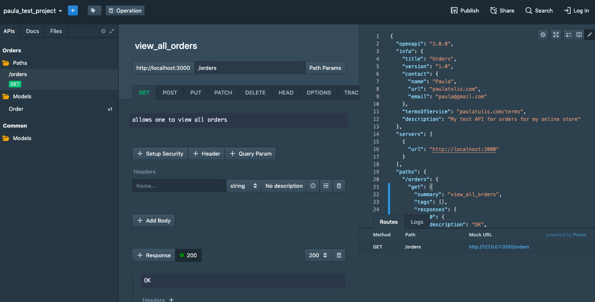
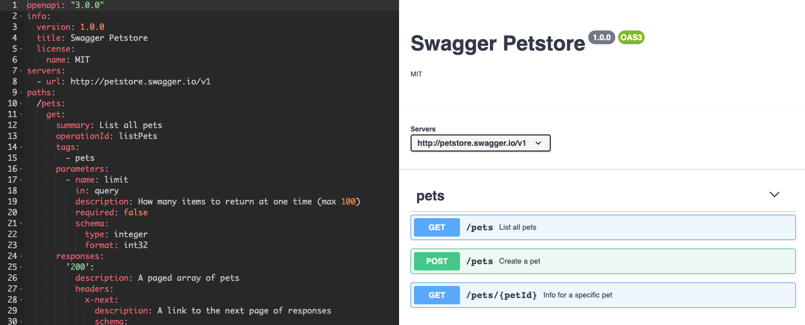

Something that I’ve always struggled with is taking a breath. When I’m excited about a new project, my mind takes off at 100 mph and I want to dive right in. When I’m anxious or stressed out, my mind still takes off at 100 mph because the only way around is through, right? Who knows. The point is, taking a moment to 1) stop, 2) inhale completely, and 3) exhale fully, has usually been something that, no matter how many times I promise myself otherwise, exists only within the confines of yoga and meditation.

  

This translates fully into my experience coding and building applications over the past several months. At the beginning of every single project week during boot camp, I would vow to myself that I’d take some quality time to really understand the user stories, data structures, and overall layout of the application. And at the end of every single project week, I would have at least one unforeseen use case arise. In doing some research recently about design-first approaches in the world of application development, I can confidently say that a lack of mindfulness is not only a personal opportunity for improvement, but something that many large teams and companies struggle with on a macro scale. 

Because I’m on an API kick as of late, I’ve been thinking a lot about how an idea goes from but a glimmer in someone’s eye to a full grown API. So, I decided to delve into what it means to have a design-first approach in this context. 

When an individual or team builds an API, sometimes they intend for it to be consumed externally by other developers, and other times they intend for an internal-only scope. In any case, the ability for that API to be leveraged successfully depends on if it’s designed well, if it’s predictable in the way it behaves, and if it meets the expectations of those using it. These qualities require planning and careful consideration, as they should. 

In moving toward standardization, best practices in API architecture have emerged over the past few years. One of these is the OpenAPI specification, which, by [definition](https://swagger.io/docs/specification/about/), is: 
 
> “a specification for machine-readable interface files for describing, producing, consuming, and visualizing RESTful web services.” 

Okay cool. What does that actually mean? 

Basically, there are certain methodologies that are widely accepted by the industry to compose, manage, document, and consume RESTful APIs. It’s better for everyone if these best practices are adopted. 

  

Thankfully, for someone who doesn’t have a deep family heritage of API architects stretching back generations, there are tools to help people build APIs that play nicely and adhere to the OpenAPI spec. Careful planning still matters, but there’s no need to know the spec line by line. Hooray!

To experience this firsthand, I tested out two different tools aimed at helping teams design, scale, and manage their APIs. And just to see what life was like before the existence of these neat tools, I tried writing a spec manually. Below are some takeaways from the experience:

## Tool 1: Stoplight Studio

Stoplight Studio is a free OpenAPI editor, which allows for the design and prototyping of RESTful APIs. It also has built-in mocking capabilities, so you can see if things are movin’ and groovin’ (aka it simulates HTTP requests and responses just like a real server). This is helpful because humans are impatient, and the sooner people can start working on things before they are perfected, the better. Fail fast and iterate mucho, amirite? 

While I was using this tool, the grunt work of looking up when a property needs to be nested inside of another, or what type of data needs to go where was abstracted for me. At the time, I didn’t realize just how much it was abstracted, but when I tried writing my own spec, this became comically obvious. 

### Some of the things I really liked about Stoplight Studio: 
1. It’s really easy to configure schema quickly
2. It’s intuitive to set up models and paths 
3. Having the ability to mock is awesome

  

  

****

## Tool 2: Swagger Editor

Swagger’s tool also allows for basic YAML/JSON editing that abides by the OpenAPI spec. The experience using this tool was a bit more challenging for a novice like myself, simply because I needed to type a lot of things that I wasn’t sure about. After struggling for a few minutes, I found a fully built-out example file and imported that into the editor, so I could play around without having to first figure out how to construct it. The UI was quite different from Stoplight’s; it felt more like a text editor I was used to working with, but I couldn’t quite find how to get the mocking to function (which either means it’s not included in the tool, or the intuition to figure it out is not included in my brain). 

### Some of the things I really liked about the Swagger editor: 
1. There’s plenty of documentation and instructional videos 
2. Code is auto-completed and validated

  

  

****

## Tool 3: Yours truly

After fiddling around with two tools meant to help people correctly design and spec APIs, I tried to do it from scratch. This exercise made me acutely aware of the muck that we don’t have to trudge through to design and scale APIs, which is already an undertaking. Honestly, it was difficult to keep my eyes focused on the literature detailing OpenAPI format, and I didn’t make it even halfway through the documentation before throwing in the towel. [It’s long](https://github.com/OAI/OpenAPI-Specification/blob/master/versions/2.0.md#swaggerObject), and I have better things to do like write blog posts and figure out how to make applications work. Call me a millennial. 

### Some of the things I really liked about no editor: 
1. Resulted in an even deeper gratitude for people who create solutions to abstract things that are incredibly tedious
2. New knowledge!

  

  
By the end of these experiments, I had a strong feeling of “not knowing what I don’t know”, which is something I love. My interest is piqued in the way that I can tell there will be challenges as I go further down the path, and I’m very much looking forward to approaching those challenges with a new-found appreciation for this area of work. Now, in the spirit of developers who create meaningful APIs with a design-first approach, I simply need to remember to take a breath first. 
